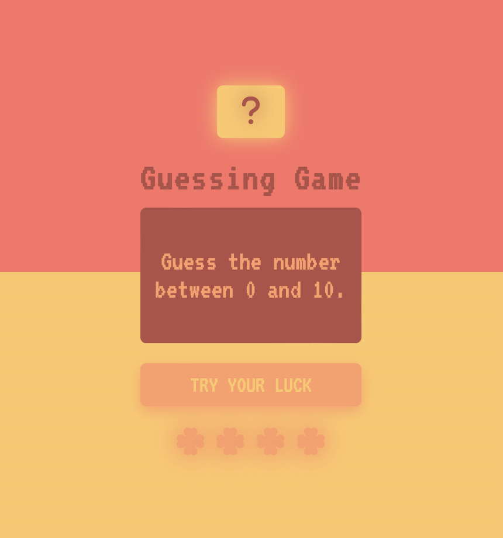
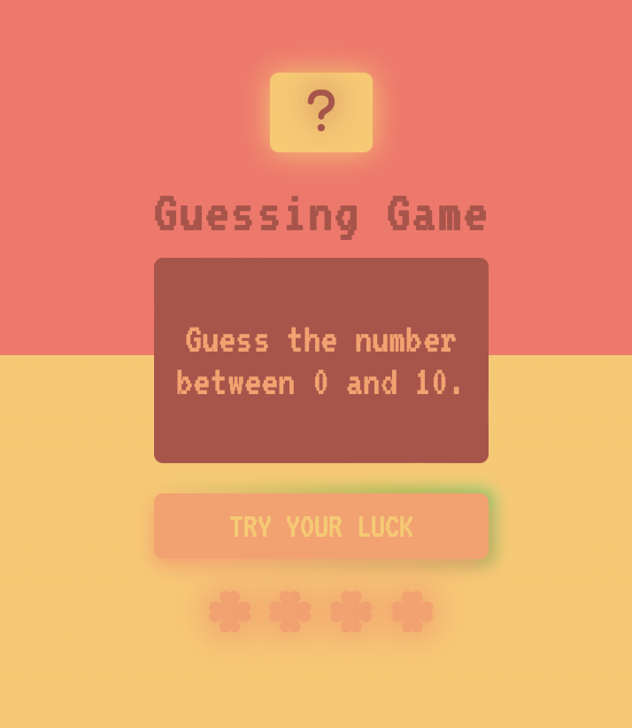
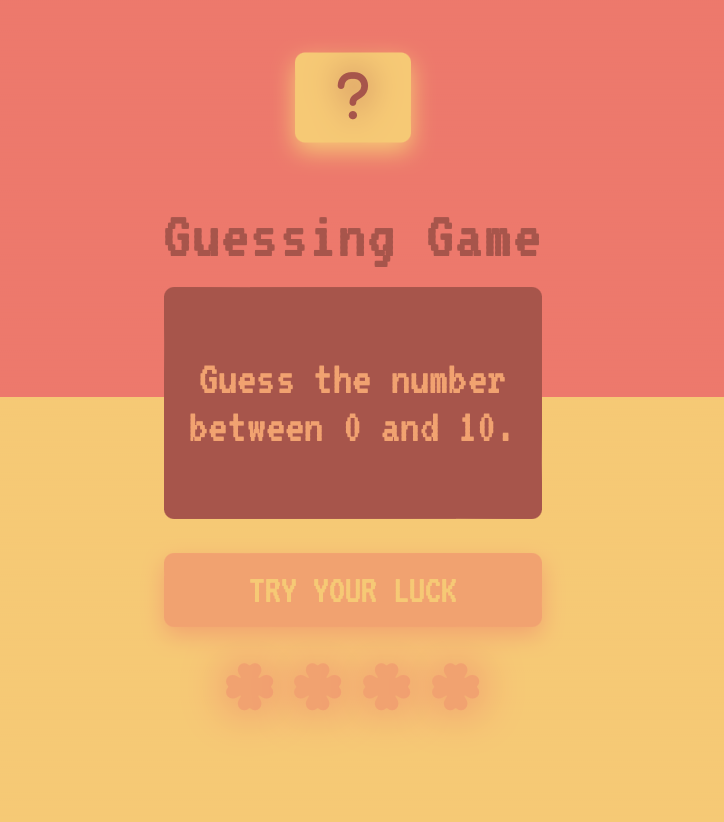

# 7DaysOfCode D-4

## Challenge: 
More loops and randomization

The fourth challenge is a guessing game against the computer. The program will ask what value you want to guess and it gives you 3 attempts. There are two solutions:

1) <strong>Using a random number:</strong> 
Math.floor(Math.random() * (maximum - minimum + 1) + minimum)

2) <strong>Using a predefined number:</strong> 
while and if/else conditionals are applied with a predefined number

### Technologies

- HTML
- CSS
- JavaScript

---

### Sample

<h4 align="center"></h4>

#### Hover with animated effect
<h4 align="center"></h4>

#### Box with a few effects
<h4 align="center"></h4>
