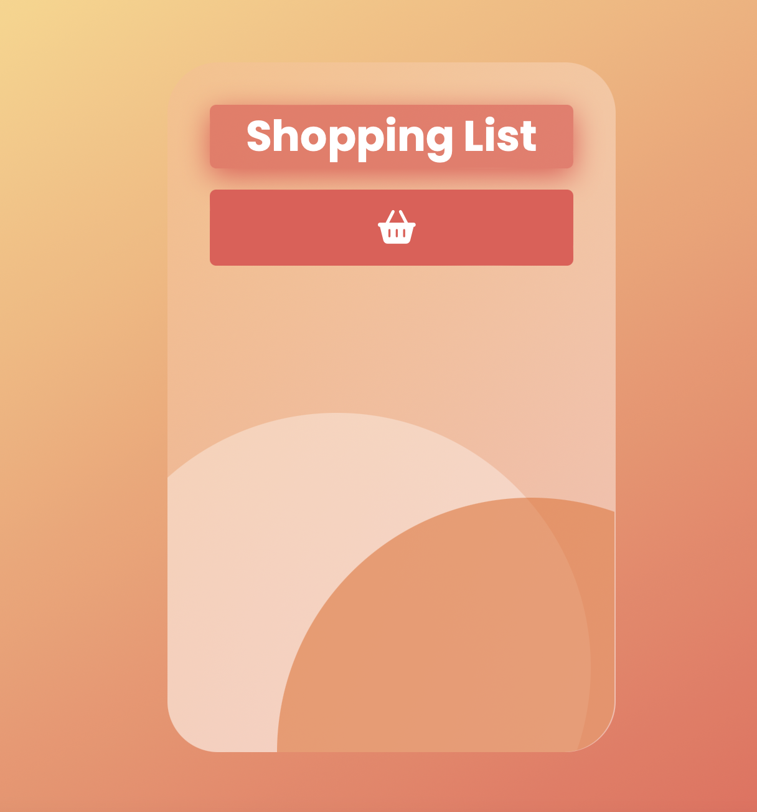
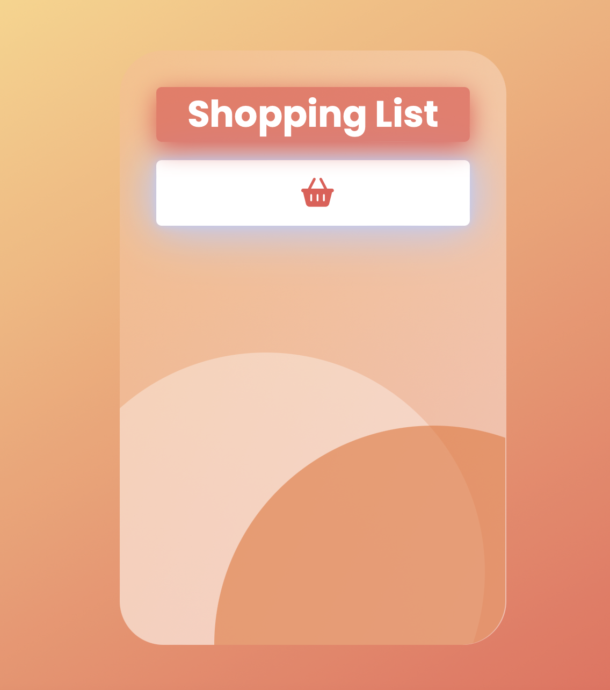

# 7DaysOfCode D-5

## Challenge: 
Arrays and collections

The fifth challenge is a basic shopping list that can evolve further ahead into projects such as an e-commerce catalog or a list of events inspired by Google Calendar. This program uses arrays, a JS function and conditionals (while / if/else / switch / for) to add different types of food to different categories and, then, display the final list.

### Technologies

- HTML
- CSS
- JavaScript

---

### Sample

<h4 align="center"></h4>

#### Hover effect
<h4 align="center"></h4>
