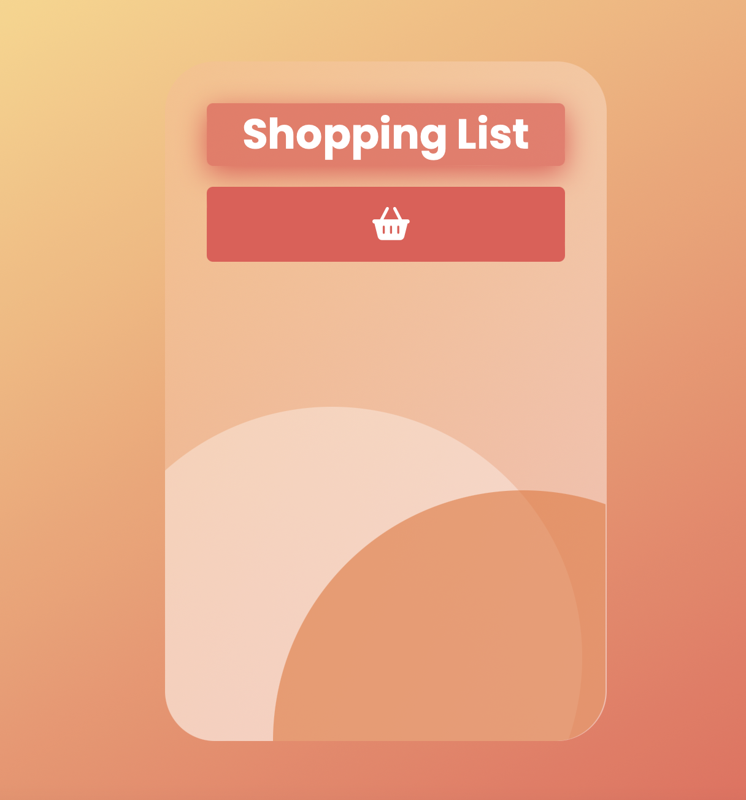
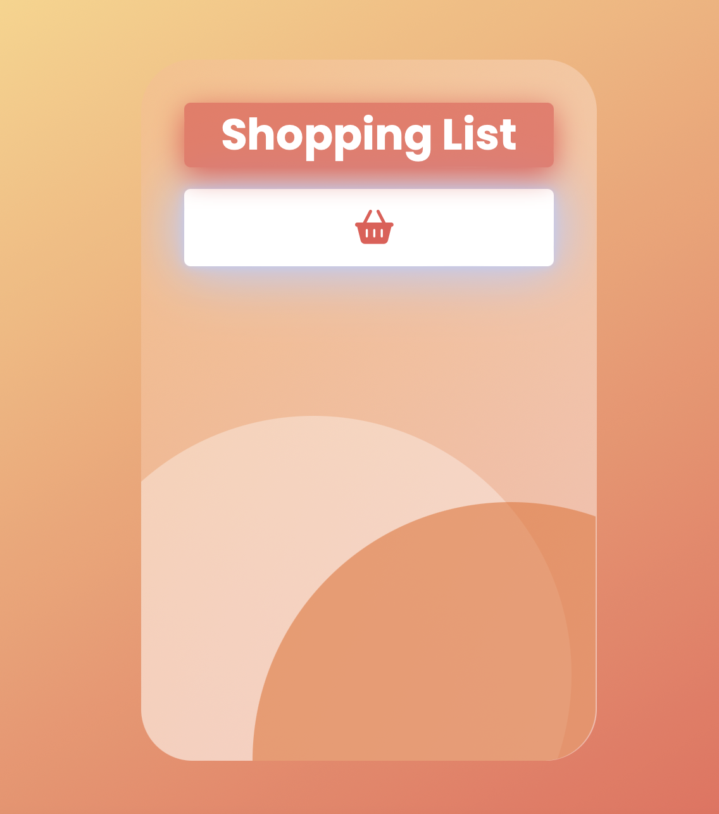

# 7DaysOfCode D-6

## Challenge: 
Array Removal

The sixth challenge is a sequence to evolve the shopping list from D-5. Now it offers the option to remove items too. I added another function and methods like indexOf and splice to deal with this part. 

### Technologies

- HTML
- CSS
- JavaScript

---

### Sample

<h4 align="center"></h4>

#### Hover effect
<h4 align="center"></h4>
