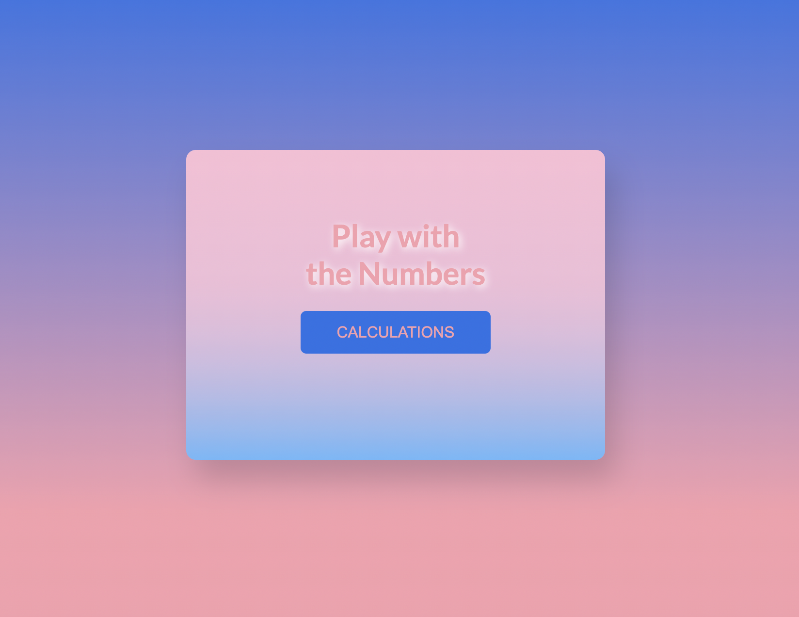

# 7DaysOfCode D-7 | Final

## Challenge: 
Functions in JavaScript

The seventh and last challenge is focused on JS functions to organize the code better. For this purpose, a simple calculator was created for addition, subtraction, multiplication and division operations. I also used while, if and switch conditionals.

### Technologies

- HTML
- CSS
- JavaScript

---

### Sample

<h4 align="center"></h4>

#### Button with flip effect to change the text
<h4 align="center"></h4>
